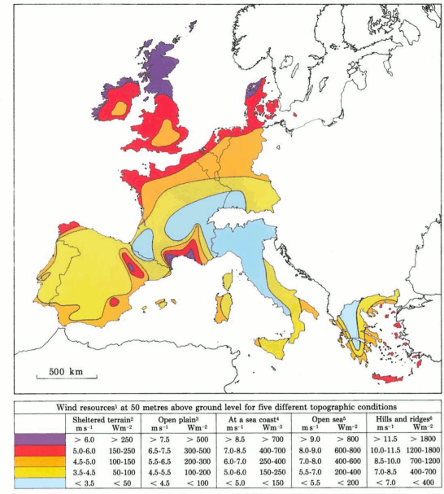
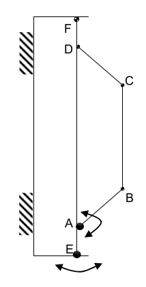
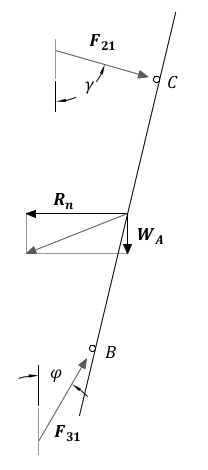
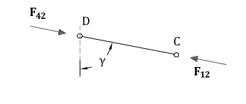
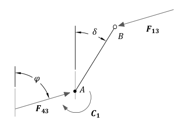
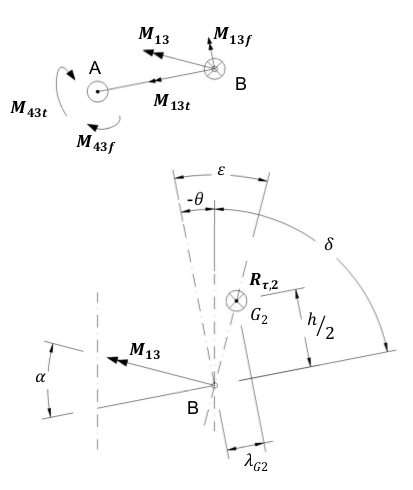
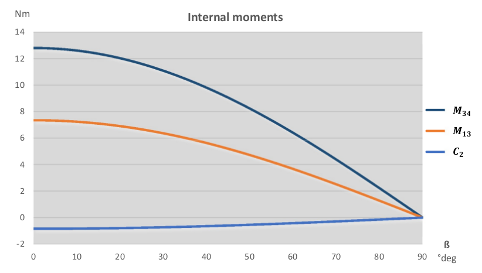
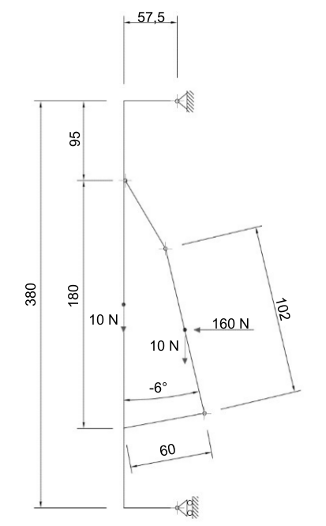

.. design:

==========
The Design
==========

This project is intended to solve particular problems in specific circumstances. Later developments evolved
the original idea to make it more flexible in different situations, but some characteristics remained the same.
The following pages will provide a more detailed explanation of those starting points.

For the mechanical study, made under current laws, two effects were considered: the gravity and the wind.
European standards Eurocodes were used to estimate the effects of the wind.

The last part of the chapter is provided a list of constructive solutions adopted.

#################
Design boundaries
#################

.. _A:

First and foremost, The Turnantenna is intended to help WCN volunteers. As said in the previous chapter,
WCN people could be unskilled, or be not sufficiently equipped for being able to replicate a complex
structure. That is the reason why the Turnantenna must be made of very cheap and readily available
hardware, and its replication should be error tolerant to construction errors [A].

.. _B:

It was already said that the Turnantenna will be self-rotating to get WMN dynamic. However, in practice
networks are frequently suited on lands where topography is variable and, in the situation where nodes are
on different altitudes, antennas needs to be tilted by a certain angle to provide an effective link. For that
reason, a proper rotation of one antenna should involve two different axis: in the horizontal and vertical
direction. The antenna will be able to turn up to 180 degrees and 13 degrees respectively [B].

.. _C:

Another consideration comes from a common manufacturing practice. For directional antennas like the one
used for this project, the most typical attaching points are vertical poles. Antennas have a particular shape
that makes easy the fixing to a tube-like support. Since the system discussed here is an upgrade of that, it
was decided to preserve this characteristic in order to maintain compatibility with older systems [C].

.. _D:

The intent of the project is to make the Turnantenna system usable almost everywhere. The most significant
environmental aspect is the wind, so it was assumed that the worst working conditions correspond to a
wind blowing at 37,5 m/s (135 km/h) [D].

.. _E:

Some other requisites comes from a practical consideration. The Turnantenna is designed to host different
antenna models, but, at the moment, this study is based on a particular one: the Ubiquity NanoStation M5
which weights 400g, is 80mm wide, 294mm high, and 65mm deep. All the forces and the stresses are a
correlate with the specific geometry of this antenna [E].

Lastly, one important feature is the cable management of the electronics. In Ninux, like in many other WMN,
the node configuration follows the “ground routing” scheme: that imply the presence of a single cable that
runs from the router to the Turnantenna, which both bring signals to the antenna and power to the
electronics. More information about the ground routing could be found in the next sub-chapter.

.. _F:

Such a configuration can be set up using a power over Ethernet (POE) injector. For this project a POE
injector capable of supplying 24W (1A at 24V) is used. Considering a power consumption of 12W for the
NanoStation antenna and 5W for the single-board computer (for more details on the electrical scheme see
the chapter 3 - ), the remaining 7W shall be sufficient for both the engines [F].

*********************
Ground routing [#f1]_
*********************

Ground routing in a WMN is a node configuration where all the traffic activity is managed by a daemon that
is installed in a single device, called *ground router*.

In multitasking computer operating systems, a daemon is a computer program that runs as a background
process, rather than being under the direct control of an interactive user [#f2]_.

Practically, in ground routing all the network administration (like decision-making about the best route to
follow to send a packet from A to B, error handling, reaction to unexpected mesh changes, ecc.) is
performed by the ground router while the antenna works just like a repeater, and it can only send or receive
data without having any decision-making power.

This is a Ninux community choice, since the routing daemon could be installed in the antenna firmware;
doing this, part of traffic management could be performed by the antenna. Therefore, in this second
scenario antennas play an active role in the route-decision computing.

Ground routing is a good choice for different reasons:

#. flexibility for the hardware adopted: for the reasons listed before, router and antennas choice is almost
   free. Firmware and routing protocols could be adopted according to personal needs without the
   necessity of dealing with software compatibility with the preferred networking daemon;

#. performances: in ground routing there is a single daemon instance per router; in other schemes there
   are one per antenna. In this second case, number of players in the routing management play increases
   exponentially, producing a significantly decrease of the entire network performance. That happens
   every time a network event occurs (like a node get off) and all the managing actors have to have
   learned about this. The more are the actors, the more is the internal traffic produced to reach everyone,
   and the less are the unallocated resources available for network users.

#. flexibility of the network: antennas and routers have very different computational capabilities. If
   antennas host the networking daemon, they could contain a smaller number of features due to the
   minor memory and less data processing capability of the antenna. Moreover, antennas are onto roofs,
   pylons or others; routers are into houses and offices instead. When it comes the time of making a big
   change in the meshing devices, the effort to reach the ones or the others will be significantly different.

.. _eurocodes:

#####
Norms
#####

The effect of the wind is calculated according to the *Eurocode 1* [#f3]_, following the guidelines indicated in the
Leonardo da Vinci Pilot Project’s handbook [#f4]_. In this study the wind will be considered quasi-static, namely
without taking into account dynamic and aeroelastic effects.

******************
Peak wind pressure
******************

One of the main parameters in the determination of wind actions on structures is the characteristic peak
wind pressure :math:`q_p`, which is influenced by local factors (e.g. terrain roughness and orography/terrain
topography) and the height above terrain. The peak wind pressure accounts for the mean pressure (basic
pressure) and a turbulence component.

To find :math:`q_b`, :math:`v_p` has to be evaluated first with the following formula.

.. math::

   v_b = c_{dir} \cdot c_{season} \cdot v_{b,0}

The fundamental value of the basic wind velocity, :math:`v_{b,0}`, is the characteristic 10 minutes mean wind velocity,
irrespective of wind direction and time of year, at 10m above ground level in open country terrain with low
vegetation such as grass and isolated obstacles with separations of at least 20 obstacle heights. These
characteristic values correspond to annual probabilities of exceedence of 0,02 which corresponds to a
return period of 50 years.

The norm distinguish situations where the wind has a particular prevalent direction, and where its speed
changes seasonally. In this project, due to the unpredictability of those factors, either the coefficients
:math:`c_{season}` will be taken unitary.

The following relationship exists between the basic velocity and the basic pressure:

.. math::

   q_b = \frac{ \rho} 2 \cdot v_b^2

where :math:`\rho` is the air density (can be set to 1,25 kg/m\ :sup:`3` )

.. _G:

The basic value of the velocity pressure has to be transformed into the value at the reference height of the
considered structure. Velocity at a relevant height and the gustiness of the wind depend on the terrain
roughness. The roughness factor describing the variation of the speed with height has to be determined in
order to obtain the mean wind speed at the relevant height. Note that the Eurocode 1 maximum value for
the height is 200 m [G].

The roughness factor related to a minimum height :math:`z_{min}` for the calculation is:

.. math::

   \begin{array}{lcl} c_r(z) = k_r \cdot ln \left( \frac z {z_0} \right), & \mbox{but} & z \geq z_{min}  \\
   k_r = 0,19 \cdot \left( \frac {z_0} {z_{0,II}} \right) ^{0,07} & & \end{array}

where:

* :math:`k_r` = terrain factor
* :math:`z_0` = roughness length
* :math:`z_{min}` = minimum height
* :math:`z_{0,II} = 0,05\ m` (terrain category II, Table 2.1)

\

+------------------+----------------------------------------------------+------------------+------------+
| Terrain category | Characteristic of the terrain                      | z_0\ [m]         | z_min\ [m] |
+==================+====================================================+==================+============+
|   0              | sea or coastal area                                | 0,003            | 1,0        |
+------------------+----------------------------------------------------+------------------+------------+
|   I              | lakes; no obstacles                                | 0,01             | 1,0        |
+------------------+----------------------------------------------------+------------------+------------+
|   II             | low vegetation; isolated obstacles with distances  | 0,05             | 2,0        |
|                  | of at least 20 times of obstacle heights           |                  |            |
+------------------+----------------------------------------------------+------------------+------------+
|   III            | regular vegetation; forests; suburbs; villages     | 0,3              | 5,0        |
+------------------+----------------------------------------------------+------------------+------------+
|   IV             | at least 15% of the surface covered with buildings | 1                | 10,0       |
|                  | with average height of at least 15 m               |                  |            |
+------------------+----------------------------------------------------+------------------+------------+

\

   Table 2-1  Terrein categories

In case of general assumption, the gust pressure (or peak pressure) :math:`q_p (z)` at the reference height of the
considered terrain category is calculated with the:

.. math::

   q_p(z) = q_b \cdot c_r(z)^2 \cdot \left[ 1+ \frac 7 {ln \left( \frac z {z_0} \right) } \right]

Given the uncertainty of both the wind conditions and environment where the Turnantenna will be mounted,
to find a design value for the peak pressure will be considered the worst reasonable case.

The basic speed was specified before :ref:`[D] <D>`; the height above terrain is taken pair to the maximum permissible
value :ref:`[G] <G>`, and it was considered that the strongest wind is felt in open lands:

:math:`v_b = 37,5\ m/s`

:math:`z = 200\ m`

:math:`Terrain\ category = 0`

Now, following the previous proceeding, the peak wind pressure could be easily found:

:math:`q_p = 4300 \frac N {m^2}`

As next step, the norm suggests to correct this value in case of particular stressing situations (e.g. buildings
on top of hills and ridges, surrounding constructions that work like convergent nozzles, ecc.). However, in
this case there is no possibility to take into account all the random peculiarities of all the different possible
scenarios, but is not even possible to exclude such of situations.

A better option is to consider the values of the mean speed indicated by the European wind Atlas [#f5]_, which
subdivides the European territory in five zones. The following map (Figure 2-1 Distribution
of wind resources in Europe. By means of the legend the available wind energy at a height of 50 metres can be
estimated for five topographic conditions. Regions where local concentration effects may occur are not
indicated.) resumes those values:

   Figure 2-1  Distribution of wind resources in Europe. By means of the legend the available wind
   energy at a height of 50 metres can be estimated for five topographic conditions.
   Regions where local concentration effects may occur are not indicated.

In the atlas, the maximum speed value is 11,5 m/s. The design wind speed is 37,5 m/s :ref:`[D] <D>` instead. The
safety coefficient results over than 3,2. This is considered enough to conclude that the peak pressure was
determined with an appropriate safety margin.

***********
Wind Forces
***********

In simplified terms, the force exerted by the wind on the antenna is given by:

.. math::

   F_w = q_p \cdot A \cdot C_f

:math:`C_f` is the force coefficient, the equivalent of the drag coefficient known in fluid dynamics. The Eurocode 1
gives the following definition:

.. math::

   C_f = C_{f,0} \cdot {\Psi}_f

where:

* :math:`C_{f,0}` , is the force coefficient of a rectangular section with sharp corners and without free-end flow, as given
  by the Figure 2-2.

* :math:`{\Psi}_f` is the reduction factor for square sections with rounded corners, Figure 2-3.

.. figure:: img/CHAPTER2/force\ coefficient.png
   :alt: Force coefficient calculus diagram

   Figure 2-2  Force coefficients of rectangular sections with sharp corners and without free end flow

.. figure:: img/CHAPTER2/reduction\ factor.png
   :alt: Reduction Factor calculus diagram

   Figure 2-3  Reduction factor for a square cross-section with rounded corners

The antenna has the following dimensions:

.. figure:: img/CHAPTER2/dimensions.png
   :alt: Ubiquity NanoStation M5 dimensions

   Figure 2-4  Ubiquity NanoStation M5 dimensions (mm)

The wind could blow either frontal or by side, so the two cases will be studied separately.

Starting from a frontal blowing wind, the :math:`b/d` ratio results to be equal to 2,6 , which determines a value of
:math:`C_{f,0}` pair to 1,3.

With a side wind, the ratio become 0,38 , with a consequent value of 2,1 for the force coefficient.

The shape of the antenna is asymmetric, and is neither a square nor a rounded shape. For that reason, the
reduction factor could be considered as the mean of the two mid-shapes. For a perfect square section the
factor is unitary, while for the rounded corners case (:math:`r = 15\ mm`) it results pair to 0,5. The mean value is
0,75.

The global force coefficient, in the worst case, is:

.. math::

   C_f = 2,1 \cdot 0,75 = 1,6

###############
Stress analysis
###############

In this section the effects of the external forces will be evaluated to find all the critical points, and to provide
a magnitude of the stress that every component will have to resist to.

First of all, the forces will be discussed and estimated; after that, a general analysis of the distribution of
the internal forces will be presented to provide a set of equations useful to find forces and moments in all
the structure. The reason of this approach is that the Turnantenna is open source, and everyone shall be
free to build it in different ways with different dimensions, but still having the possibility to benefit from this
work. Lastly, most critical pieces will be verified.

***********
Definitions
***********

The antenna must be able to rotate around two axis :ref:`[B] <B>`. The figure below shows the scheme of the system.
Points E and F are fixed, and are cylindrical joints that allow the rotation of the rotating frame (A-B-C-D)
around the vertical axis.

The two engines are hosted in A and E; B and C correspond to the attaching points of the antenna to the
four-bar linkage.

   Figure 2-5  Scheme of the Turnantenna. E-F frame is fixed; A-B-C-D can rotate around the vertical
   axis; C-B are the fixing points of the antenna, and have 2 degrees of freedom.

The hatches represent the fixings to a tube-like support :ref:`[C] <C>`.

**************************
External forces evaluation
**************************

Using the :ref:`Eurocode <eurocodes>` approach, it was possible to find the pressure of the wind and the drag
coefficient. In the most general case, the wind could blows in all directions. Furthermore, wind from both
sides produces the same effects on the structure, and rear wind could be considered basically equivalent
to frontal wind. The β angle is introduced to characterize the wind direction, which is considered always
horizontal; for symmetry, it’s sufficient to study the effects in a quarter-turn domain.

The β angle is defined as follows:

.. math::
   \begin{cases} \beta = 0, & \mbox{side wind} \\
                 0 < \beta < \frac \pi 2, & \mbox{general wind} \\
                 \beta = \frac \pi 2, & \mbox{frontal wind}
   \end{cases}

.. figure:: img/CHAPTER2/wind_direction.png
   :alt: wind direction scheme

   Figure 2-6  Explanation of the β angle

To evaluate the wind effects, the force it is divided into two components, one orthogonal and one tangential
to the face of the antenna:

.. math::

   R_n = q_p \cdot c_f \cdot \sin \beta \cdot A_{A,n}

   R_{\tau} = q_p \cdot c_f \cdot \cos \beta \cdot A_{A,\tau}

where :math:`A_n` and :math:`A_{\tau}` are the frontal and the side area of the antenna; :math:`q_p` and :math:`c_f`
are the peak wind pressure and the force coefficient found in the previous chapter.

This study is based on the following hypothesis:

* the mobile frame LEFM (Figure 2-7) is a rectangular section tube t × k;

* the force developed by the action of the wind on the rockers and the horizontal extensions of the frame
  is negligible:

* the antenna will be sketched as two parallelepipeds jointed together:

  * A prims with the dimensions of the antenna itself :math:`(w_A \cdot h_A)`

  * A smaller one that takes into account the contribute of the two supports :math:`(w_A \cdot h_A) / 2`

To make it clear, the sketch used to perform the calculus is shown in Figure 2-7 , while the real mobile
frame is very similar to Figure 2-6.

.. figure:: img/CHAPTER2/schematic_frame.png
   :alt: schematic frame

   Figure 2-7  Schematic representation of the mobile frame used to calculate the side wind forces

The vertical axis of rotation is in the middle between the vertical face of the frame and the antenna. The
pressure acting on these two areas will cause the birth of two parallel forces with opposite direction. That’s
why the two areas need to be considered separately.

Areas values result:

.. math::

   \begin{array}{c}
   A_{A,n} = b_A \cdot h_A \\
   A_{{\tau}_1} = A_{A,\tau} + A_{Supports,\tau} = w_A \cdot h_A (1 + 0,5) \\
   A_{{\tau}_2} = A_{Frame,\tau} = \overline{EF} \cdot t
   \end{array}

The weight of the entire system will be evaluated approximately, since there is not a definitive constructive
solution. The antenna mass is 400g :ref:`[F] <F>`. It is supposed that, together with the rockers, it will reach 1kg. The
mobile frame is supposed to have the same mass of the antenna group, and the fixed one the double of
this quantity:

:math:`m_A = 1\ Kg`

:math:`m_M = 1\ Kg`

:math:`m_F = 2\ Kg`

.. _static_analysis:

***************
Static analysis
***************

The following part will discuss the distribution forces and moments over the Turnantenna structure for all
the configurations determined by the pitch angle θ, without specifying any geometrical information. All the
expressions will be given in their general form and, only after, final results will be listed.

On first examination, the wind direction will be considered perfectly frontal :math:`\beta = \frac \pi 2`
with the only effects induced by :math:`R_n`. Later, a tangential component will be added, and evaluated.

Frontal wind
============

The wind is considered perfectly frontal. That means that angles have the following values:

.. math::

   \begin{cases}
      \theta \in [-6°, 7°] \\
      \beta = \frac \pi 2
   \end{cases}

The external forces here are:

* :math:`W_A = m_A \cdot g \approx 10\ N`

* :math:`W_M = m_M \cdot g \approx 10\ N`

* :math:`R_n = q_p \cdot c_f \cdot A_{A,n} = 4300\ \frac N {m^2} \cdot 1,6 \cdot 0,294\ m \cdot 0,08\ m \approx 160\ N`

A more detailed scheme of the Turnantenna, which has a shape similar to the one illustrated in Figure 2-6,
is shown in Figure 2-8. In a first approximation all the elements could be idealised as rigid beams.

.. figure:: img/CHAPTER2/forces.png
   :alt: Scheme of the forces on the Turnantenna

   Figure 2-8  Scheme of the Turnantenna: the mobile frame assembly

**Beam 1**
----------

The first beam, as shown in Figure 2-9, is subjected to four forces: the weight of the antenna :math:`W_A`, the effect
of the wind pressure :math:`R_n`, and the internal forces :math:`F_{21}` and :math:`F_{31}`.

The bar number 2 is hinged on both the ends, consequently :math:`F_{21}` corresponds to the physical angle γ. The force
:math:`F_{31}` will have its same direction, that is not align with the beam 3; it’s identified by the angle
φ which has not a direct connection with the physical angle δ.

The following equations are valid since the beam is in a state of equilibrium:

.. math::

   \begin{array}{rl}
      x ] & F_{21} \cdot \sin \gamma + F_{31} \cdot \sin \varphi = R_n \\
      y ] & F_{31} \cdot \cos \gamma = P_A + F_{21} \cdot \cos \varphi \\
      M_{(B)} ] & R_n \cdot \frac h 2 \cdot \cos \theta - P_A \cdot \frac h 2 \cdot \sin \theta -
                                                      F_{21} \cdot h \cdot \sin{(\gamma + \theta)} = 0
   \end{array}

which can give the following expressions:

.. math::

   \begin{array}{c}
      F_{21} = \frac {\frac {R_n} 2 \cdot \cos \theta - \frac {P_A} 2 \cdot \sin \theta } {\sin (\gamma + \theta)} \\
      F_{31} = \frac {R_n - F_{21} \cdot \sin \gamma} {\sin \varphi} \\
      \varphi = \arctan (\frac {R_n - F_{21} \cdot \sin \gamma} {P_A + F_{21} \cdot \cos \gamma})
   \end{array}

   Figure 2-9  Beam 1

**Bar 2**
---------

This bar has revolute joints on both the ends, and it results to be compressed. The only two forces applied
are equal in magnitude and opposite in direction. As clarified in Figure 2-10, the equilibrium gives:

.. math::

   F_{42} = F_{12} = F_2

   Figure 2-10  Bar 2

**Beam 3**
----------

The third beam is hinged on both the sides, but in the point A the engine apply a moment to the beam to
hold it in position. The two internal forces will be mutually parallel, and will apply a torque balanced by the
engine (Figure 2-11), which could be calculated as:

.. math::

   C_1 = F_{13} \cdot l \cdot \sin (\varphi - \delta)

More equations come from the same hypothesis of balance:

.. math::

   \begin{array}{c}
      F_{43} = F_{13} = F_3 \\
      F_{3 \bot} = F_3 \cdot \sin(\varphi - \delta) \\
      F_{3 \parallel} = F_3 \cdot \cos(\varphi - \delta)
   \end{array}

:math:`F_{3 \bot}` and 3 :math:`F_{3 \parallel}` are the components of the force :math:`F_3` perpendicular and parallel
to the beam 3, and :math:`C_1` is the estimate of the real torque that the first engine has to bear when the wind blows
at 37,5 m/s.

   Figure 2-11  Beam 3

**Beam 4**
----------

Looking to the beam 4 scheme in Figure 2-12, the following equations could be written

.. math::

   \begin{array}{rl}
      x ] & H_L + H_M = F_{34} \cdot \sin \varphi + F_{24} \cdot \sin \gamma \\
      y ] & V_M = W_M + F_{34} \cdot \cos \varphi - F_{24} \cdot \cos \gamma \\
      M_{(F)} ] & V_M \cdot \overline{FM} + C_1 - F_{34}\cdot \overline{AF}\cdot \sin \varphi -
            F_{24}\cdot \overline{DF} \sin \gamma + H_L \cdot \overline{EF} = 0
   \end{array}

From which could be obtained:

.. math::

   \begin{array}{c}
      V_M = W_A + W_M \\
      H_L = \frac {F_{34} \cdot \overline{AF} \cdot \sin \varphi + F_{24} \cdot \overline{DF}
            \cdot \sin \gamma - C_1 - V_M \cdot \overline{FM}} {\overline{EF}} \\
      H_M = F_{34} \cdot \sin \varphi + F_{24} \sin \gamma - H_L
   \end{array}

Where V and H are respectively the horizontal and the vertical reactions of the fixed frame constraints.

.. figure:: img/CHAPTER2/beam4_frontal_w.png
   :alt: Scheme of the fourth beam

   Figure 2-12  Beam 4

Generic wind direction
======================

In this part, the effect of a lateral wind will be taken into account. At this point it is necessary to consider the
whole effect of the wind as the β angle changes.

.. math::

   \begin{cases}
      \theta \in [-6°, 7°] \\
      \beta = ( 0, \frac \pi 2 )
   \end{cases}

To study the structure when :math:`\beta ≠ \frac \pi 2`, the principle of superposition of the effects allows to re-use the resulting
equations of the previous part, and to sum the side wind effects in order to obtain a complete analysis.

To get the problem single-variable, the reader should know that, in the next chapter
:ref:`"Internal stress determination" <internal stress>`, maximum stresses are obtained when the pitch angle is
:math:`\theta =-6°`. This is valid for every wind speed values and for all directions.

In summary, the pitch angle will be kept fixed, while β changes, because a change in the β angle produce
the exactly same output as a change in the yaw angle. Applying this approach, the study results to be very
fast and with no loss of reliability.

A lateral wind cause the birth of a moment :math:`C_2` which, as :math:`C_1` , represent the torque exerted by the
secondary engine to maintain the antenna in the desired position when wind blows. The characterising force of this
moment is the tangential component of :math:`R` , the application point distance depends on the particular
geometrical schematization.

Introducing a reference system λ − κ with the origin Q placed at the centre height on the left corner of the
antenna block (Figure 2-13), with the axis tilted at θ angle, positive for left-to-right and bottom-to-top
directions, the λ coordinate of the centre of mass is:

.. math::

   \lambda_{G_2} = \frac {\sum ^N _{i=1} S_{κ, i}} {A_{tot}} =
      \frac {w_A \cdot \frac {h_A} 2 \cdot \frac {w_A} 2 + w_A \cdot h_A \cdot \frac 3 2 \cdot w_A} {\frac {w_A} 2 \cdot h_A + w_A \cdot h_A}
      = \frac 7 6 w_A

where :math:`S_{κ, i}` is the first moment of area of each :math:`i` element in the κ direction, and :math:`A_{tot}`
is the total area.

.. figure:: img/CHAPTER2/lateral_wind.png
   :alt: Reference system for the lateral wind configuration

   Figure 2-13  Reference systems

As said at the beginning of this chapter, :math:`C_2` is the sum of two opposite effects. The distances, that allow to
calculate them, are the ones going from :math:`G_1` and :math:`G_2` to the axis of rotation, named respectively
:math:`d_1` and :math:`d_2`.

In x-y coordinates:

.. math::

   \begin{array}{c}
      d_1 = \overline{FM} = \overline{EL} \\
      d_2 = |y_{G_2}| - d_1
   \end{array}

:math:`\overline{FM}` and :math:`\overline{EL}` are geometrical parameters.

:math:`G_1` and :math:`G_2` are defined into two different reference systems; to find :math:`y_{G_2}`
the λ coordinate of G should be
added to the y coordinate of the centre Q, which is in the middle between B and C :math:`(\overline{BC} = l)`.

.. math::

   \begin{array}{cc}
      A \begin{cases}
         y_A = 0 \\
         z_A = - \frac H 2
      \end{cases} &
      D \begin{cases}
         y_D = 0 \\
         z_D = + \frac H 2
      \end{cases} \\
      B \begin{cases}
         y_B = y_A - l \cdot \sin \delta \\
         z_B = z_A + l \cdot \cos \delta
      \end{cases} &
      C \begin{cases}
         y_C = y_D - l \cdot \sin \gamma \\
         z_C = z_D - l \cdot \cos \gamma
      \end{cases}
   \end{array}

.. math::

   \begin{array}{c}
      Q \begin{cases}
         y_Q = \frac {y_B + y_C} 2 \\
         z_Q = \frac {z_B + z_C} 2
      \end{cases} \\
      G_2 \begin{cases}
         y_{G_2} = y_Q - \frac 7 6 w \cdot \cos \theta \\
         z_{G_2} = z_Q - \frac 7 6 w \cdot \sin \theta
      \end{cases}
   \end{array}

All the elements are ready. The following analysis will take into account only the effects caused by lateral
winds: frontal wind and weight will be summed with the principle of superposition of the effects.

**Beam 1**
-----------

The first beam is connected with the third one with a revolute joint, and with the second one with a spherical
bearing. Therefore, the bar 2 will not react with any force, while the third beam will exert a force and a
moment.

The external force :math:`R_{\tau,2}` induce a rotation around a not permitted axis, hence a composite moment with both
a flexural and a torsional component will stress the beam 1 (Figure 2-14).

.. math::

   \begin{array}{c}
      F_{31} = R_{\tau,2} \\
      M_{31f} = R_{\tau,2}\cdot \frac h 2 \\
      M_{31t} = R_{\tau,2}\cdot \lambda_{G_2}
   \end{array}

The vectorial sum of this two moments is:

.. math::

   M_{31} = \sqrt{M_{31f}^2 + M_{31t}^2}

.. figure:: img/CHAPTER2/beam1_lateral_w.png
   :alt: Scheme of the first beam

   Figure 2-14  Beam 1 – lateral wind

**Bar 2**
----------

The bar number two has two spherical bearings on the extremities. It has freedom to rotate around the
vertical axis, and can’t bear loads from the side.

**Beam 3**
-----------

The third beam is fastened in A to the fourth one, and has a revolute joint connection with the first one
(Figure 2-15). The moment :math:`M_{13} = M_{31}` exerted by the beam 1 is:

.. math::

   \overrightarrow{M_{13}} = \overrightarrow{BG_2} \times \overrightarrow{R_{\tau 2}}

It is a vector, and its direction forms an angle α with the beam 3:

.. math::

   \alpha = \frac \pi 2 - \delta -(-\theta) + \varepsilon

where is highlighted that θ in negative. ε is defined as:

.. math::

   \varepsilon = \arctan \left( \frac {{\lambda}_{G_2}} {\frac h 2} \right)

Finding the components of the moment :

.. math::

   \begin{array}{c}
      M_{13f} = M_{13} \cdot \cos \alpha \\
      M_{13t} = M_{13} \cdot \sin \alpha
   \end{array}

the following equations can be written:

.. math::

   \begin{array}{c}
      F_{43} = F_{13} \\
      M_{43f} = M_{13f} + F_{13} \cdot l
      M_{43t} = M_{13t}
   \end{array}

allowing to find :math:`M_{43} = \sqrt{M_{43f}^2 + M_{43t}^2}`. The angle between this moment and the third beam is ρ
and it is:

.. math::

   \rho = \arctan \left( \frac {M_{43f}} {M_{43t}} \right)

   Figure 2-15  Beam 3 (above) and angles definition (below) - lateral wind

**Beam 4**
-----------

The fourth beam has two collinear revolute joints, in L and in M. The vertical axis of rotation pass through
those points. In L the engine exert a torque :math:`C_2` to keep the mobile frame still. In A, the third beam apply the
moment :math:`M_34` , equal to :math:`M_43`, which has a direction identified by ρ (Figure 2-16).

The flexional and the torsional components can be found with:

.. math::

   \begin{array}{c}
      M_{34f} = M_{34} \cdot \cos \left[ \rho - \left( \frac \pi 2 - \delta \right) \right] \\
      M_{34f} = M_{34} \cdot \sin \left[ \rho - \left( \frac \pi 2 - \delta \right) \right]
   \end{array}

From the condition of equilibrium:

.. math::
   \begin{array}{rl}
      x ] & R_{\tau,1} + F_{34} = K_L + K_M \\
      y ] & (R_{\tau,1} + F_{34}) \cdot d_1 - M_{34t} = C_2 \\
      M_{\overline{FM}} ] & R_{\tau,1} \cdot \frac {\overline{EF}} 2 + F_{34} \cdot \left( \frac {\overline{EF}} 2 + \frac h 2 \right)
            - M_{34f} - K_L \cdot \overline{EF} = 0
   \end{array}

the resulting equations are:

.. math::
   \begin{array}{c}
      K_L = \frac {R_{\tau,1}\cdot \frac {\overline{EF}} 2 + F_{34} \frac {\overline{EF} + h} 2 - M_{34f}} {\overline{EF}} \\
      K_M = R_{\tau,1} + F_{34} - K_L
   \end{array}

with particular interest in:

.. math::

   C_2 = (R_{\tau,1} + F_{34})\cdot d_1 - M_{34t}

To verify the outcome, the following equation provides a more direct way to calculate :math:`C_2`:

.. math::

   C_2 = R_{\tau,1} \cdot d_1 - R_{\tau,2} \cdot d_2

.. figure:: img/CHAPTER2/beam4_lateral_w.png
   :alt: Scheme of the fourth beam
   :width: 100%

   Figure 2-16  Beam 4 - lateral wind

.. _internal stress:

*****************************
Internal Stress Determination
*****************************

To evaluate the stresses in a real application, the following geometrical data will be assumed:

* :math:`h=102\ mm`

* :math:`l=60\ mm`

* :math:`H=180\ mm`

* :math:`\overline{FD}= \overline{AE} = 95\ mm`

* :math:`\overline{EF} = 370\ mm`

* :math:`\overline{FM}=d_1=57,5\ mm`

  :math:`\rightarrow d_2=22,7\ mm`

* Rectangular section aluminium tube frame :math:`t \times k = 25 \times 25\ mm`

* Antenna’s dimensions :math:`294 \times 80 \times 31\ mm`

.. figure:: img/CHAPTER2/geometry.png
   :alt: Scheme of the fourth beam

   Figure 2-17  Fundamental geometrical values

Note: during the following analysis, the effects of the wind on the antenna will not be taken into account,
since the device is not under design, and it was not possible to access to any information about its
mechanical behaviour under stress.

With a perfect frontal wind, that blows ad 37,5 m/s and develop a pressure of 4300 Pa with a drag coefficient
of 1,6 , it is possible to use the equations showed in the previous chapter ":ref:`Static analysis <static_analysis>`"
to plot the following graph:

.. figure:: img/CHAPTER2/graph_frontal.png
   :alt: Forces graph for a frontal wind

.. figure:: img/CHAPTER2/graph_frontal2.png
   :alt: Torques graph for a frontal wind

As first clear conclusion, the most critical condition appears to be the one corresponding to the angle
θ = −6°. Moreover, :math:`R_n` is a monotonic increasing function of the β angle, and a change of β will change the
scale, but will not affect the overall trend the functions shown in the graphs above.

In light of this, it is sufficient to consider a fixed value for θ, and change β.

.. figure:: img/CHAPTER2/graph_lateral.png
   :alt: Forces graph for a lateral wind

In these last two graphs, it emerges a practical consideration: while the particular geometry allows to have
a very low torque on the second engine (:math:`C_2`), the most critical component, in case of side wind, is the rocker
linked to the first engine (beam 3), which has to bear the action of :math:`M_13` and :math:`M_34`.

The most stressful working conditions are two:

* the one corresponding to a frontal wind: θ = −6° and β = 90°

* the one with a completely side wind: θ = −6° and β = 0

In order to give a more clear representation of the stress distribution in the following section will be shown
the load charts. The first load configuration is the following:

   Figure 2-18  Load configuration for θ = −6° and β = 90°

And the corresponding load chart is the one below, where forces are expressed in N, and moments in Nm.
Forces results were rounded to the nearest multiple of 5, and moments to the first decimal point.

.. figure:: img/CHAPTER2/load_chart_frontal.png
   :alt: Load charts

   Figure 2-19  Load chart for θ = −6° and β = 90°

The principle of superposition of the effects allows to study the second load configuration in a double-step
procedure. Since the frontal wind is absent, the two addends of the sum will be the weight and side wind.

.. figure:: img/CHAPTER2/load_chart_lateral.png
   :alt: Load charts

   Figure 2-20  Load chart for θ = −6° and β = 0 – effects of weight

.. figure:: img/CHAPTER2/load_chart2_lateral.png
   :alt: Load charts

   Figure 2-21  Load chart for θ = −6° and β = 0 – effects of side wind

Using the previous graphs, it is possible to evaluate how elements of the structure are stressed.

----------------------------

.. [#f1] Ninux, “Ground Routing HowTo”, `Ninux.org <http://ninux.org>`_
.. [#f2] LINFO, `“Daemon Definition” <http://www.linfo.org/daemon.html>`_, 2005
.. [#f3] European Union, “Eurocode 1: Actions on structures - Part 1-4: General actions - Wind actions” (EN 1991-1-4), 2005
.. [#f4] Leonardo da Vinci Pilot Project, `“Handbook 3 Action effects for buildings” <http://eurocodes.jrc.ec.europa.eu/showpublication.php?id=64>`_, 2005, CZ/02/B/F/PP-134007
   26.7.2017
.. [#f5] Troen Ib, Lundtang Petersen Erik, “European Wind Atlas”, 1989, ISBN 87-550-1482-8
