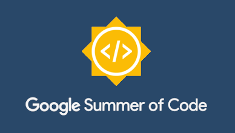

.. gsoc2018:

==============================
</> GSoC 2018
==============================

**WARNING - this page is under construction**

**Name:** Marco Musumeci

**email:** crm.marco@gmail.com

**Name of the project:** Re-write the Turnantenna code

**Project proposal:** `Google doc <https://docs.google.com/document/d/1Q-oulJjKZjLFy5CSwCw5wHYoTUovHZ-WObPjIujLJF8/edit?usp=sharing>`_

**Host organizations:** `Freifunk <https://freifunk.net/>`_, `Ninux <http://ninux.org/FrontPage>`_

########
About me
########

This is the first time I can say I seriously coded. In my past experiences I never approached the act of writing code
with the final goal of sharing it.
Code for yourself is a thing; code for the community, and with the community, is something very different.

I'm not a software developer: I'm a mechanical engineer, and in these three months I've learned a lot of things that I
could never learn on my own. I have to say thanks to my mentor and to the Ninux community for the strong support they
gave me in this period, and for giving me this possibility. But the time is up, and I'm going to summarise what I
achieved during the summer.

##########
1st period
##########

*05/15 - 06/15*

During the first month I had to deal with the driver of the engine. The Ninux community developed a first prototype
of the Turnantenna, and I started working on it. At the very first time I created a new branch in GitHub called
`"test" <https://github.com/Musuuu/punter_node_driver/tree/test>`_.

I spent the greater amount of time writing tests and trying to understand how to improve the pre-existing algorithm. I
learned how to use 'unittest', and how to use 'mocks' from zero. It was really challenging.

I wrote a more detailed review of that period in this `article <https://blog.freifunk.net/2018/06/10/the-turnantenna-first-evaluation-update/>`_.

##########
2nd period
##########

*06/16 - 07/13*

In the first week of the second period, I had to complete the previous work on the driver test. After that, I started
to work on this documentation. It was a very hard work, and it took all the three weeks remained.

At the same time, I worked on a first version of the States Machine, and learned the basics in order to work with flask
and to build the web interface.

The article relative to the work done could be found `here <https://blog.freifunk.net/2018/07/08/the-turnantenna-second-evaluation-update/>`_

##########
3rd period
##########

*07/14 - 08/14*

The last moth was really productive. During the first three weeks I worked on the API definition and the optimization
of the States Machine. I learned how to use the 'multiprocessing' and coded the main process: now it can handle the
engine process, the flask RESTful services, and the States Machine.

In the last week I have focused on code refactoring. For this new task I worked on the new dedicated
branch `"refactor" <https://github.com/Musuuu/punter_node_driver/tree/refactor>`_.

Like before, the detailed review of the work is in this `article <https://blog.freifunk.net/2018/08/13/the-turnantenna-final-evaluation-update/>`_.

-------------------------

#################
Final conclusions
#################

The initial goal of the project was to write a full working driver and web interface for the Turnantenna. I can say that
the 90% of the work was done.

Things done:

* Rewrite the engine driver

* Test the driver

* Write the API

* Test the API

* Create a RESTful web service

* Make things work together

Things to do:

* Make time estimation during the movement of the engine more accurate and correct tests in test_stepmotor.py

* Write the potentiometer "pot_get_position" function

* Implement the system onto the hardware
