.. _solutions:

=================
Adopted Solutions
=================

To understand the reasons behind some crucial decisions, it is useful to go through the evolution of the
prototype of the Turnantenna. That will be discussed in the first part of this chapter.

In the second part, some characteristic choices will be argued and verified.

##########################
Evolution of the prototype
##########################

The actual version of the Turnantenna model is not the first one. During design, a big effort was devoted to
figure out a clever concept, able to meet the needs of the final users and to work safely in hard :ref:`working
conditions <requirements>`.

**************
Turnantenna V1
**************

The first version of the prototype was strictly intended to define a working electronic system. Electronics
was a priority, since the whole system has a very limited power capability.

The Figure 3-1 outlines connections between the electronic components. This setup works and is already
in use.

In the image below, it is possible to notice the :ref:`ground routing <ground_routing>` configuration discussed before.
In fact, the router is situated in an accessible place inside the building and while the antenna is outside.
The router is the intelligent element and hosts the networking daemon; the antenna works just like a
repeater and doesn’t take any decision.

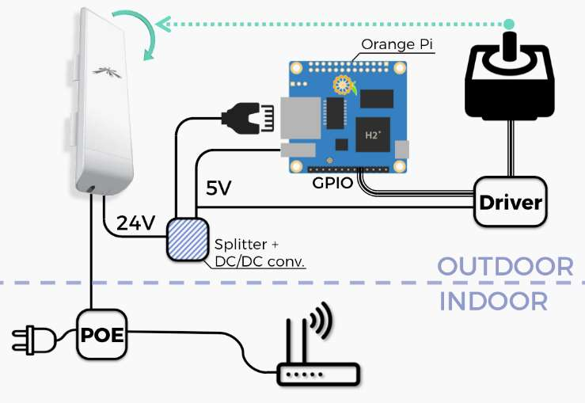

   Figure 3-1  Electronic scheme

The elements in the scheme, following a clockwise order, are:

* a router;

* a POE injector, which supply the 24W of power to the outer components trough the Ethernet cable;

* the Ubiquity NanoStation M5 antenna, that has two Ethernet ports, one for the input and one for the
  output. The antenna works to 24 volts;

* a splitter to separate data connection from electric power;

* a DC/DC converter that reduce the 24 volts to 5 volts, consistent with the voltage supply of the boards;

* an Orange Pi, a small sized computer. It has all the elements necessary for hosting an operative system
  (i.e. CPU, HD, RAM), for receiving commands from a network (i.e. network interface), and for controlling
  the engine drivers (i.e. GPIO pins);

* the drivers and the engines.

The first prototype is shown in the following pictures:

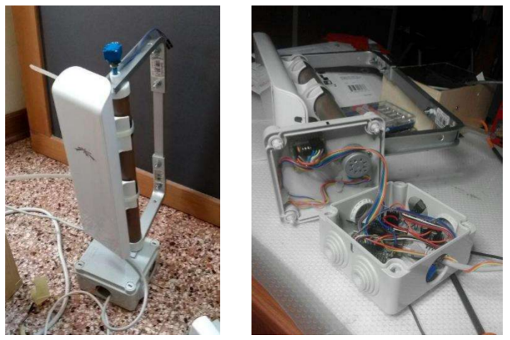

   Figure 3-2  The first version of the prototype of the Turnantenna

**************
Turnantenna V2
**************

Once it has been established that the electronic is working, the next step was to think about a mechanical
structure that fully met the :ref:`design requirements <requirements>` .

In this version, the central element remained similar to the older one; a big effort was spent to think at an
easy-to-replicate tilt system. It was introduced the four-bar linkage because of its simplicity and the
advantages of its use i.e. the mechanical stress induced by the wind is absorbed by the pin of the linkage,
and not by the shaft of the engine. This last point is important, since the rotational stresses are very limited
compared to the forces on the rockers.

To keep things simple, one of the best solution is 3D printing, used for all the blue pieces in the following
renders (Figure 3-3 and Figure 3-4).

FFF printing represents a very cheap solution and allows the realization of very complex parts with minimal
difficulty. For example, if in the future the antenna will be substituted, a new set of supports could be printed
to adapt the whole structure to the new device.

The plastic used is the ASA (Acrylonitrile Styrene Acrylate), which has a high resistance to the UV and very
good mechanical properties. The Table 3-1 Formfutura ApolloX ASA technical data sheet
shows the technical data provided by the vendor.

\

+-----------------------+--------------------+-------------+------------------------+
| Property              | Typical value      | Test Method | Test Condition         |
+=======================+====================+=============+========================+
| Specific gravity      |1100 kg/:math:`m^3` | ISO 1183    |                        |
+-----------------------+--------------------+-------------+------------------------+
| Tensile strength      | 47,5 MPa           | ISO 527     | @ Yield 50mm/min       |
+-----------------------+--------------------+-------------+------------------------+
| Tensile modulus       | 2020 MPa           | ISO 527     | 1 mm/min               |
+-----------------------+--------------------+-------------+------------------------+
| Melting temperature   | ± 230 ± 10°C       | ISO 294     |                        |
+-----------------------+--------------------+-------------+------------------------+
|Viscat softening temp. | ± 98°C             | ISO 306     | VST/A/50 (50°C/h, 10N) |
+-----------------------+--------------------+-------------+------------------------+

\

    Table 3-1  Formfutura ApolloX ASA technical data sheet [#f1]_

As can be easily seen in Figure 3-4, the kinematic chains are formed by the engine and a gear reducer
(enclosed inside the blue ASA carter), the synchronous pulley and belt system. The reason why all these
reduction steps are needed is that engines are very small, due to the very limited electrical power available,
and the wind action is remarkable. More details on the :ref:`engines <engines>` design will be provided later.

Another detail that should be noted is the use of rod end bearings for the upper rocker. Using this particular
joints, the structure gains more construction error tolerance, and is not subject to the risk of binding.

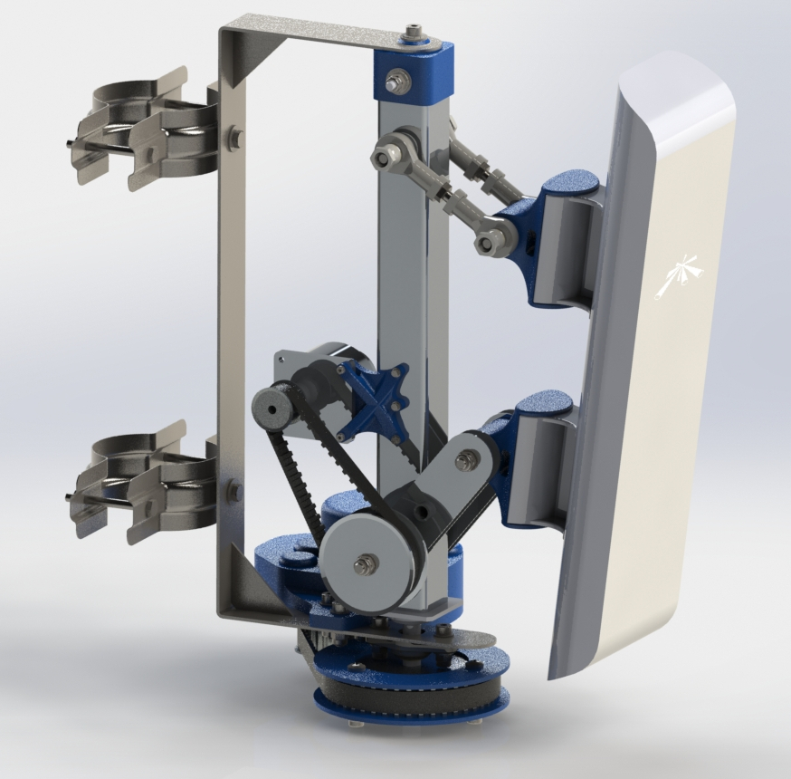

   Figure 3-3  The second version of the prototype of the Turnantenna

.. figure:: img/CHAPTER3/17.JPG
   :alt: Prototype V2 - detail

   Figure 3-4  The lower kinematic chain

.. _v3:

**************
Turnantenna V3
**************

During the realization of the real prototype, the first problem encountered was the weight of the main piece
of the moving frame. This piece is made of a tube and a flanged pin, welded together.

The intrinsic problem of this solution, for a non-professional mechanic, is that it requires the usage of steel.
Steel is the cheapest, easy to weld, easy to find metal. Since the primary target of this work are low-skill
people, steel is the only solution. But steel is very heavy, and the piece mentioned earlier reached the
weight of more than 1 kg. One alternative solution is the usage of aluminium, which is not easy to weld,
and requires specific, more complex and costly welding machines.

In addition to the weight, another problem comes from the realization of the turned pin: it requires a lathe.

+----------------------------------+-----------------------------------+
| .. figure:: img/CHAPTER3/pin.jpg | .. figure:: img/CHAPTER3/tube.jpg |
|    :alt:                         |    :alt:                          |
|    :width: 100%                  |    :width: 100%                   |
+----------------------------------+-----------------------------------+
| .. figure:: img/CHAPTER3/tube&pin.jpg                                |
|    :alt:                                                             |
|    :width: 100%                                                      |
+----------------------------------------------------------------------+

\

    Figure 3-5  The central piece of the mobile frame in Turnantenna v2: the pin, the tube and the assembled component

For all the reasons listed above, in the newer version the straight steel tube was replaced with a C shaped
aluminium one. This change brought some other side benefits:

* the connection between the mobile frame with the fixed one has become easier

* the torque exerted on the second engine was decreased of about one order of magnitude

Figure 3-6 and Figure 3-7 show the more practical mounting system in the newer version.

In Figure 3-6, (1) is the flanged pin; (2) is a flange bearing; (3) is a pulley; (4) is a plastic cap, which has a nut
embedded; (5) is the fixed frame; (6) is a thrust washer. The cap is fastened with the central element of the
mobile frame; the top bolt assure a spacer with the cap, leaving a little clearance between the frame and
the lower surface of the spacer. Thanks to this gap, the thrust washer allows the rotation of the mobile
frame, which is controlled by the pulley, force matched with the pin.

In Figure 3-7, (1) is a bolt; (2) and (4) are tubes; (3) are thrust washers; (5) is a flange bearing. The bolt fastens
the tube and the mobile frame together; the tube is a bit longer than the fixed frame thickness, and leave a
clearance where to place the thrust washers. In the bottom, another bolt keeps the tube (4), and another
tube below, fixed together with the mobile frame; the frame will rotate under the action of the engine (not
shown) on the bolt.

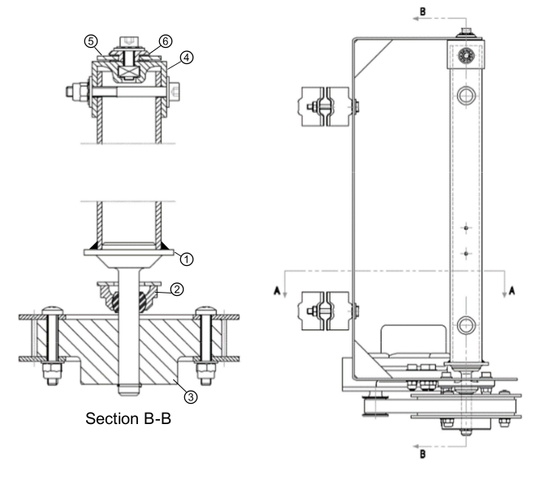

   Figure 3-6  Turnantenna v2 connection system

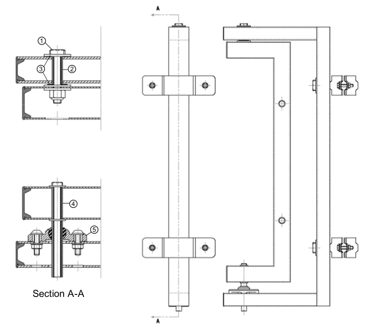

   Figure 3-7  Turnantenna v3 connection system

Figure 3-8 shows the difference in the torque between the two versions, caused by a change in the
distances between the application point of the wind forces and the axis of rotation.

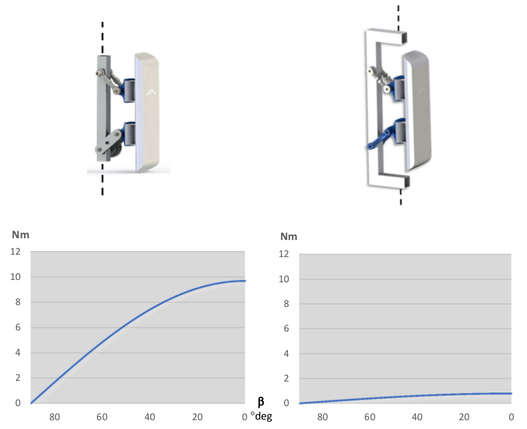

   Figure 3-8  Difference of :math:`C_2` torque between Turnantenna v2 (left) and v3 (right)

This kind of reduction in the :math:`C_2` magnitude allows the removal of the belt reduction system, reflecting on a
lower weight of the entire system, a considerable cut of the cost and a simpler setup operation.

Another changes have been done to make the system simpler and stiffer, i.e.:

* the lower rocker was designed to be 3D printed, since the older version was unnecessarily complex;

* the main frame is now made of rectangular section welded tubings, instead of the old cut and bended
  sheet. In this way the system results to be stiffer.

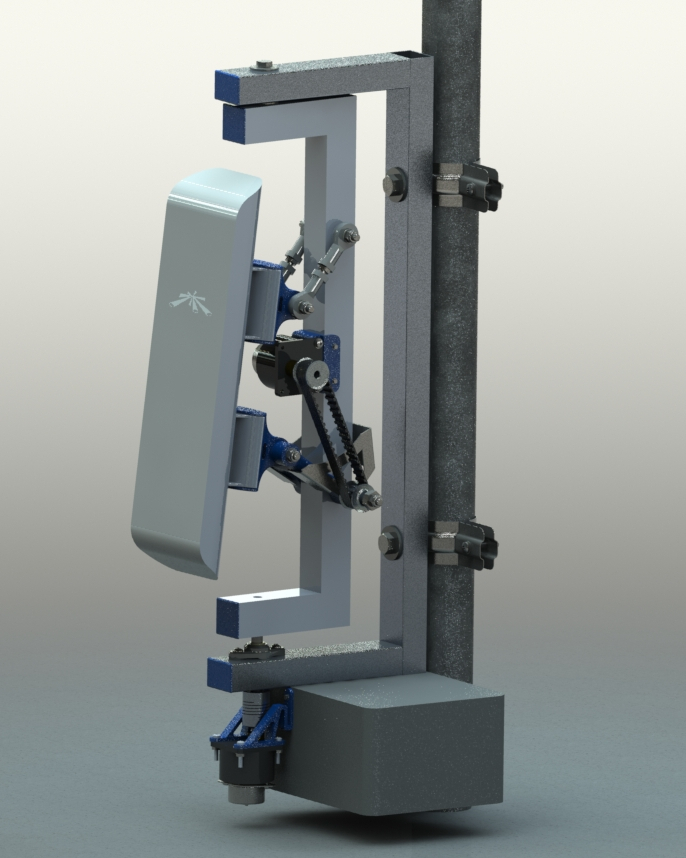

   Figure 3-9  The third version of the prototype of the Turnantenna

######################################
Components selection and verifications
######################################

The Turnantenna project is not close and the optimization work is in progress. The
list of requisites that guides the designing process could be found :ref:`here <requirements>`; solutions can be
verified using the equations :ref:`here <stress_analysis>` and, in the end, their application are tested on the prototype.

In this section the most important solutions will be discussed.

****************
Polymer bearings
****************

Polymer bearings have several advantages: they are

* self-lubricant

* compact

* resistant to dust, dirt and water

* cheap

Polymer bearings resist in a relative wide temperature range, from -40°C up to 130°C for long-term
applications.

In the Turnantenna system, polymer bearings are a very good solution since they are cheap, easy to use
and there is no need to do maintenance.

Thrust washers
==============

Polymer thrust washers permit the turning of the mobile frame, in presence of compressive forces, dust,
dirt and high humidity.

They are positioned in the top pin, between the washers and the fixed frame. The bolt tighten the washers,
the tube and the mobile frame together, while the bearings are free to float, held in place by gravity. The
upper bearing sustain the weight of the mobile assembly, the lower one is there for safety, to provide support
in rare cases of updrafts.

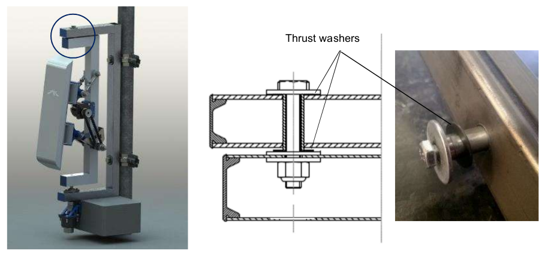

   Figure 3-10  Polymer thrust washers position

The upper washer is under the :ref:`compressive effect of the force <stress_analysis>` :math:`V_M = 20\ N`. The
component used is the iglide G300 GTM-0815-005 by igus, which has the following characteristics:

\

+------------------------------+-------------------+-------------+-----------+
| Property                     | Typical value     | Test Method | Tolerance |
+==============================+===================+=============+===========+
| Shaft diameter               | 8,0 mm            | -           | +0,25 mm  |
+------------------------------+-------------------+-------------+-----------+
| Outer diameter               | 15,0 mm           | -           | -0,25 mm  |
+------------------------------+-------------------+-------------+-----------+
| Thickness                    | 0,5 mm            | -           | -0,05 mm  |
+------------------------------+-------------------+-------------+-----------+
| Pv value, max. (dry)         | 0,42 MPa·m/s      | -           | -         |
+------------------------------+-------------------+-------------+-----------+
| Max. recommended surface P   | 80 MPa            | -           | -         |
+------------------------------+-------------------+-------------+-----------+
| Max. long-term application T | 130 °C            | -           | -         |
+------------------------------+-------------------+-------------+-----------+
| Low application T            | -40 °C            | -           | -         |
+------------------------------+-------------------+-------------+-----------+

\

    Table 3-2  igus iglide G300 GTM-0815-005 technical data sheet

The pressure applied on the bearing, and the average linear speed are:

.. math::

    \begin{array}{c}
    P = \frac {4F} {\pi (D^2 - d^2)} = 0,16\ MPa \\
    v = \omega \cdot \overline{r} \approx 0,1\ m/s
    \end{array}

assuming a rotation speed in the order of magnitude of 1 rad/s (it is an ideal maximum, in reality it will be
slower). The resulting values are very small and, putting them inside the charts below, they result to be
perfectly verified for every reasonable working conditions.

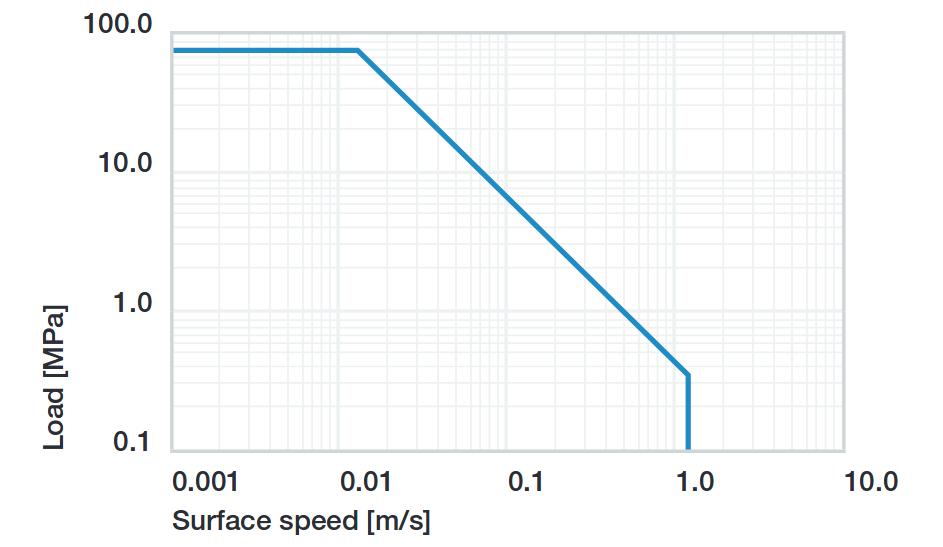

   Figure 3-11  Permissible Pv values for iglide G with a wall thickness of 1mm in dry operation at 20°C

.. figure:: img/CHAPTER3/max_pressure.png
   :alt: Max load per temperature diagram

   Figure 3-12  Recommended maximum surface pressure as a function of temperature (80MPa at 20°C)

Sleeve bearings with flange
===========================

This kind of bearings are used for all the four-bar linkage pins. Pins are made of threated rod M5. The force
exerted on the pin is diffused by a tube with the internal diameter of 5 mm, which also works as spacer
between the rockers.

The safety nuts are tightened on to the rockers, kept in position by the tube. Sleeve bearings are assembled
on the central piece (the antenna support in Figure 3-13) with interference. The whole width of the central
element is a bit shorter than the tube. In this manner, when rockers are fastened together with the tube, the
central element can freely rotate on it, because no pressure is exerted on its sides.

Washers help to diffuse the pressure between the elements.

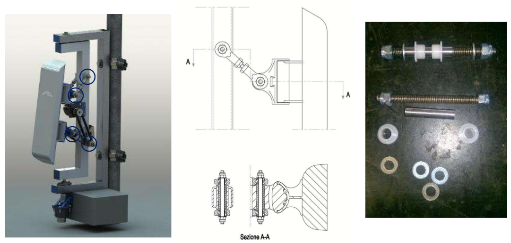

   Figure 3-13  Polymer sleeve bearing positions

As seen :ref:`before <internal stress>`, the most critical element is the beam 3 when β = 0 and θ = −6°. In this situation,
the pin between the lower rocker and the mobile frame is under the combined effect of the following forces:

* :math:`T = 10\ N`

* :math:`N = 5\ N`

* :math:`M_f = 4,9\ Nm`

* :math:`M_t = 2,1\ Nm`

Considering forces exerted by the wind on the beam 3, they have the directions represented in Figure 3-14.
:math:`T` and :math:`M_t` have the same direction of the rocker (δ angle), :math:`N` and :math:`M_f` are perpendicular to it.

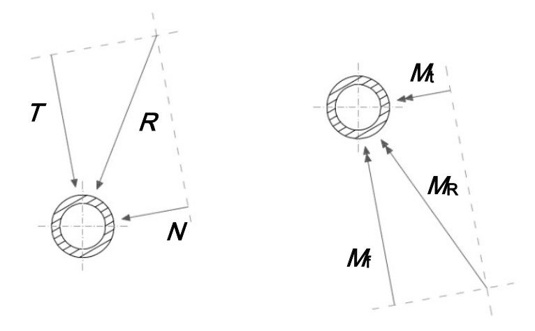

   Figure 3-14  Force analysis on sleeve bearings

In Figure 3-15 there is the scheme adopted to evaluate the effect of the forces on the bearings: a force, or moment,
can be deemed equivalent to a pressure applied on to the contact surface. To simplify, pressures are considered uniforms.
Therefore, a local resultant force acting in the middle is equivalent to those pressures.

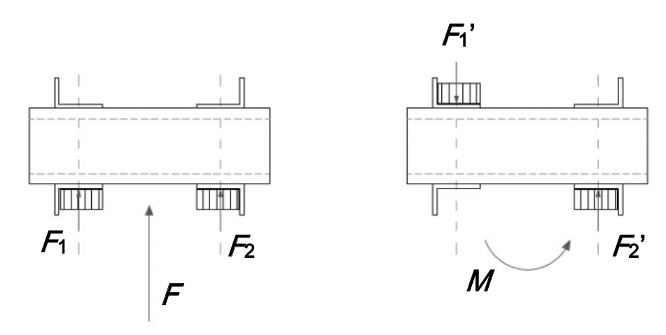

   Figure 3-15  Force analysis on sleeve bearings

Bearings position is defined by the central element, which has a width of 28 mm, and correspond to the
distance between the inwards surfaces of the flanges. Sleeve bearings are 5 mm long. The distance
between the application points of the forces is:

.. math::

    L = \frac l 2 + w + \frac l 2 = 33\ mm

now :math:`F_1’` and :math:`F_2’` can be found with:

.. math::

    F_1' = F_2' = \frac M L

forces that compose :math:`M_t` act in the same direction of :math:`T` ; :math:`N` is related to :math:`M_f` instead.
:math:`R_1` and :math:`R_2` are the resulting forces in the two directions:

.. math::

    \begin{array}{c}
    R_1 = T \pm \frac {M_t} L = 10\ N \pm \frac {2500\ Nmm} {33 mm} \\
    R_2 = N \pm \frac {M_f} L = 5\ N \pm \frac {7700\ Nmm} {33 mm}
    \end{array}

The ± symbol represent the fact that one bearing will be stressed by the combination of the two effects,
while the other bearing (the parallel one located on the same axis) will bear the difference between the
effects.

:math:`R_1` and :math:`R_2` are mutually perpendicular and, in the worst case, their sum is:

.. math::

    R_{tot} = \sqrt{R_1^2 + R_2^2} = 253\ N

Since the bearing inner diameter is 6mm, and it length was specified above:

.. math::

    P = \frac {R_{tot}} {l \cdot d} = 8,4\ MPa

The bearing chosen is the iglidur R A180, and the following table summarise its characteristics:

\

+------------------------------+-------------------+-------------+-----------+
| Property                     | Typical value     | Test Method | Tolerance |
+==============================+===================+=============+===========+
| Shaft diameter               | 6,0 mm            | -           | E10       |
+------------------------------+-------------------+-------------+-----------+
| Outer diameter               | 8,0 mm            | -           | H7        |
+------------------------------+-------------------+-------------+-----------+
| Thickness                    | 1 mm              | -           | -         |
+------------------------------+-------------------+-------------+-----------+
| Pv value, max. (dry)         | 0,31 MPa·m/s      | -           | -         |
+------------------------------+-------------------+-------------+-----------+
| Max. recommended surface P   | 28 MPa            | -           | -         |
+------------------------------+-------------------+-------------+-----------+
| Max. long-term application T | 90 °C             | -           | -         |
+------------------------------+-------------------+-------------+-----------+
| Low application T            | -50 °C            | -           | -         |
+------------------------------+-------------------+-------------+-----------+

\

    Table 3-3  igus iglide A180 A180FM-0608-06 technical data sheet

The low pressure and the speed comparable with the one calculated for the thrust washers in the previous
section, guarantee the good working conditions of the sleeve bearings with flange in all the reasonable
conditions considered in this work.

.. figure:: img/CHAPTER3/pv_flanged.png
   :alt: Pressure times speed diagram

   Figure 3-16  Permissible Pv values for iglide A180 with a wall thickness of 1mm in dry operation at 20°C

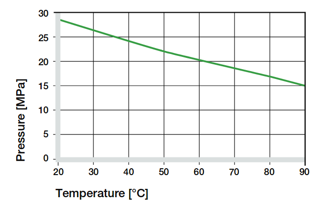

   Figure 3-17  Recommended maximum surface pressure as a function of temperature (28MPa at 20°C)

Articulated heads
=================

The upper rockers of the four-bar linkage are made of two of those particular elements, jointed together by
a piece of threated rod M5 (Figure 3-18). The assembly of the articulated heads with the pin is shown in
Figure 3-13; in this case, the threated pin is in direct contact with the metal sleeve of the rod end.

Articulated heads have been chosen to avoid the binding of the system. According with the hypothesis that
the Turnantenna could be built by unexperienced people, the probability of make machining errors is very
high. If all the four linkage axis are not perfectly aligned, the system do not work properly. The adoption of
spherical joints, instead, provides a high error tolerance.

According to the stress analysis, on these components is applied just one force: it is parallel to the rocker
direction, and its magnitude is pair to 140N when θ = −6° and β = 90° (frontal wind). This means that the
resulting force exerted on a single head is 70N.

.. figure:: img/CHAPTER3/articul_heads.png
   :alt: Pressure times speed diagram

   Figure 3-18  Picture and render

The articulated head has the following characteristics:

\

+-----------------------------------+---------------+-------------+-----------+
| Property                          | Typical value | Test Method | Tolerance |
+===================================+===============+=============+===========+
| Shaft diameter                    | 5,0 mm        | -           | -         |
+-----------------------------------+---------------+-------------+-----------+
| Thread                            | M5            | -           | -         |
+-----------------------------------+---------------+-------------+-----------+
| Max pivot angle                   | 30°           | -           | -         |
+-----------------------------------+---------------+-------------+-----------+
| Max. static tensile strength      | 500 N         | -           | -         |
+-----------------------------------+---------------+-------------+-----------+
| Max. radial load                  | 125 N         | -           | -         |
+-----------------------------------+---------------+-------------+-----------+
| Max. torque strength through ball | 12 Nm         | -           | -         |
+-----------------------------------+---------------+-------------+-----------+

\

    Table 3-4  igus igubal KBRM-05 MH technical data sheet

In all the cases, the force exerted is low enough to make the system work with a high safe margin.

Flange bearings
===============

The upper revolute joint of the mobile frame is made with a pin and two thrust washers. The lower joint,
instead, is a flange bearing, and this choice has been done for many reasons:

* it keeps the structure isostatic

* it amplifies construction and machining errors tolerance, also thanks to the oblong holes

* helps during assembly: one time the lower pin and the central body of the mobile frame are mounted
  together, they can tilt; the insertion and the extraction of the element in place become much more easier
  and do not require the disassembly of the component

The flange pin is showed in the next figure. The section is extracted from Figure 3-7

.. figure:: img/CHAPTER3/flange.png
   :alt: Pictures and technical schemes

   Figure 3-19  Flange bearing position

The worst case scenario for this component is when the wind blows from the front. In that situation, it has
to bear a horizontal force of 80N.

\

+----------------------------+---------------+-------------+-----------+
| Property                   | Typical value | Test Method | Tolerance |
+============================+===============+=============+===========+
| Shaft diameter             | 8,0 mm        | -           | -         |
+----------------------------+---------------+-------------+-----------+
| Length                     | 44,2 mm       | -           | -         |
+----------------------------+---------------+-------------+-----------+
| Oblong hole d x l          | 4,3 x 6,5 mm  | -           | -         |
+----------------------------+---------------+-------------+-----------+
| Max pivot angle            | 25°           | -           | -         |
+----------------------------+---------------+-------------+-----------+
| Max. permitted axial load  | 350 N         | -           | -         |
+----------------------------+---------------+-------------+-----------+
| Max. permitted radial load | 550 N         | -           | -         |
+----------------------------+---------------+-------------+-----------+

\

    Table 3-5  igus igubal EFOM-08 technical data sheet

Again, the maximum load permitted long term is a grade of magnitude higher than the maximum force, and
the EFOM-06 could be enough. The EFOM-06 is smaller, and its shaft diameter is 5mm, perfect to fit with
a M5 rod end, like the previous bearings. EFOM-08 needs a new rod instead, and this choice is not the
best, from a practical point of view.

.. _engines:

***************
Stepper Engines
***************

The choice of how to move the Turnantenna was not so simple. The market offer a wide range of engines,
of different types, but stepper motors was rated as the best choice.

Stepper engines has a bad electrical efficiency, but are accurate in the movement, since they move one
step at time; they are brushless and have a long lifetime. But the key advantage of those motors is a
consequence of the permanent magnets they have inside. Even when the engine is not powered, there is
a residual torque exerted by the engine. The implications of this characteristic will be clear next.

To summarise what wrote before, the engines have to respect the following conditions:

* the overall power consumption for both the engines must be lower than 7W

* max torque exerted by the wind are :math:`C_1 = 3,5\ Nm` for the horizontal axis, and :math:`C_2 = 0,9\ Nm` for
  the vertical axis.

Engines
=======

The limited power source do not allow to use one engine alone. A reducer is needed to amplify the small
torque and bear the wind load.

The engine of choice, for both the cases, is the McLennan 26M048B-1U, which has the following
characteristics:

\

+------------------------------------+---------------+-------------+-----------+
| Property                           | Typical value | Test Method | Tolerance |
+====================================+===============+=============+===========+
| Typology                           | Unipolar      | -           | -         |
+------------------------------------+---------------+-------------+-----------+
| Holding torque (engine stationary) | 0,009 Nm      | -           | -         |
+------------------------------------+---------------+-------------+-----------+
| Tension                            | 5 V           | -           | -         |
+------------------------------------+---------------+-------------+-----------+
| Current                            | 250 mA        | -           | -         |
+------------------------------------+---------------+-------------+-----------+
| Step angle                         | 7,5°          | -           | -         |
+------------------------------------+---------------+-------------+-----------+
| Steps per revolution               | 48            | -           | -         |
+------------------------------------+---------------+-------------+-----------+

\

    Table 3-6  McLennan 26M048B-1U technical data sheet [#f2]_

The power consumption is approximately the twice the product between voltage and tension (because there
are two coils powered at a time), that results to be 2,5 W per motor. Two of those engines leave enough
energy to manage possible power peaks, and to expand the Turnantenna with some other device (e.g.
passive sensors, other kind of antennas like radio or LoRa, ecc.).

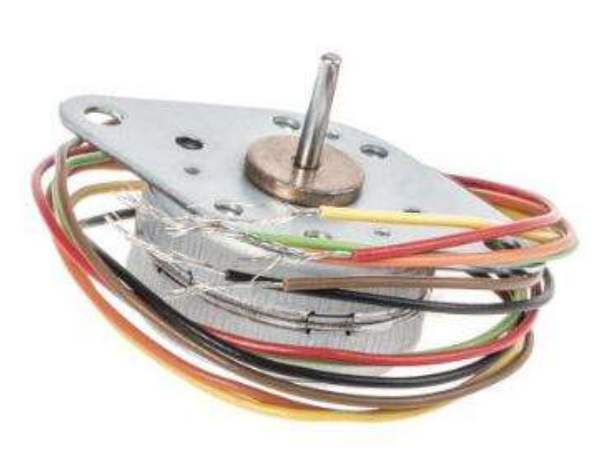

   Figure 3-20  McLennan 26M048B-1U

The torque exerted by the engine changes with the speed of rotation. The operation diagram below shows
how the motor behaves in a range of different rotational speeds.

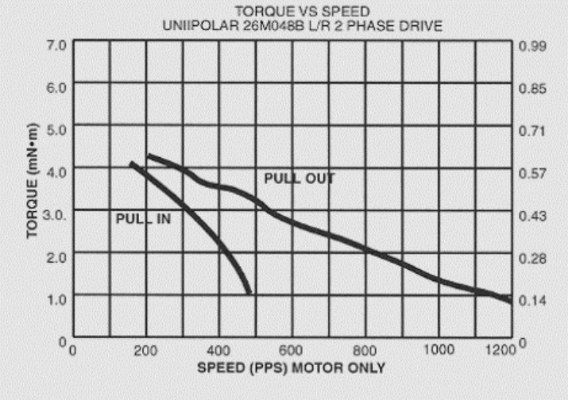

   Figure 3-21  Operation diagram of McLennan 26M048B-1U

where 1 PPS (Pulse per Second) is equivalent to 60s/48steps = 1,25 rpm.

Having the characteristics of the engines, the next step will be choosing the gear reducers.

**Reducer 1**
-------------

The first reducer is one of the most critical elements of the entire Turnantenna system. To provide a correct
torque at the end of the kinematic chain, the reduction ratio has to be more than

.. math::

    \tau = \frac {3,5\ Nm} {0,009\ Nm} = 389

In addition to this, the reducer will obviously bear the external torque without breaking and, hopefully, in
case of overload, it has to be sufficiently tough to resist and allow the loss of step by the engine.

A reducer that satisfy all these requirements is the Crouzet 81037005, which has the following
characteristics:

\

+--------------+---------------+-------------+-----------+
| Property     | Typical value | Test Method | Tolerance |
+==============+===============+=============+===========+
| Output ratio | 500:1         | -           | -         |
+--------------+---------------+-------------+-----------+
| Max torque   | 5 Nm          | -           | -         |
+--------------+---------------+-------------+-----------+

\

    Table 3-7  Crouzet 81037005 technical data sheet

When the wind blows at the maximum speed (37,5 m/s), the resulting torque of the gear reducer will be:

.. math::

    T = 0,009 \cdot 500 = 4,5\ Nm > C_1 = 3,5\ Nm

This value is enough to keep the antenna in position. Moreover, if a gust of wind overloads the antenna,
exerting a torque greater than 3,5 Nm, the engine will lose steps, and lose the orientation, but the gear
reducer will be safe and will not burst.

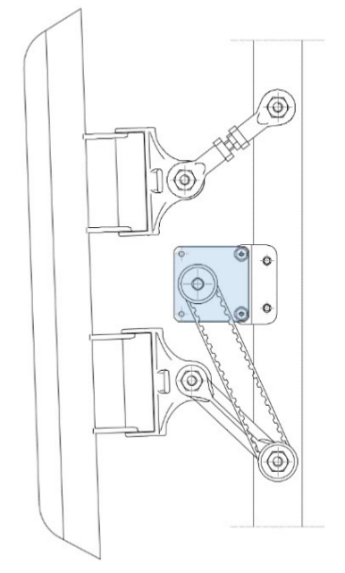

   Figure 3-22  Engine and first reducer mounting representation

The only problem of this reducer, is its cost that is excessive related to the rest of the system. This is why
in future a different system will be studied to optimise the costs and the performances.

The engine is mounted on the reducer, which is fixed to the mobile frame through a 3D printed bracket. The
torque is transmitted by a synchronous belt to the lower rocker.

**Reducer 2**
-------------

The second engine is far less problematic than the first one. The change of the shape from the version 2
to the 3 overturned the situation for this component (see :ref:`Turnantenna V3 <v3>`).

The minimum ratio value is

.. math::

    \tau = \frac {0,9\ Nm} {0,009\ Nm} = 100

The choice is between two reducers which cost the same, but different ratios. One has 100, the second
200. Since the rotational speed is not important in this case, the choice has gone to the second one
because, at the same price, the maximum torque is doubled and a certain safe margin helps in case of
future upgrades.

\

+--------------+---------------+-------------+-----------+
| Property     | Typical value | Test Method | Tolerance |
+==============+===============+=============+===========+
| Output ratio | 200:1         | -           | -         |
+--------------+---------------+-------------+-----------+
| Max torque   | 1,8 Nm        | -           | -         |
+--------------+---------------+-------------+-----------+

\

    Table 3-8  Trident Engineering GS38.0200 technical data sheet

.. math::

    T = 0,009 \cdot 200 = 1,8\ Nm > C_2 = 0,9\ Nm

that is equal to the construction limit. It is not positive at all, since the reducer may be damaged. The best
solution would be to have a gear ratio in the middle between 100 and 200. However, if the torque reaches
this value, the wind must blows much faster than the worst cases considered in this work.

The second gear motor is mounted below the frame, fixed to the electronic box. To make the engine works
correctly, it needs to be perfectly aligned with the axis of rotation but, since a number of construction errors
are possible during the process, a few tricky solutions were needed.

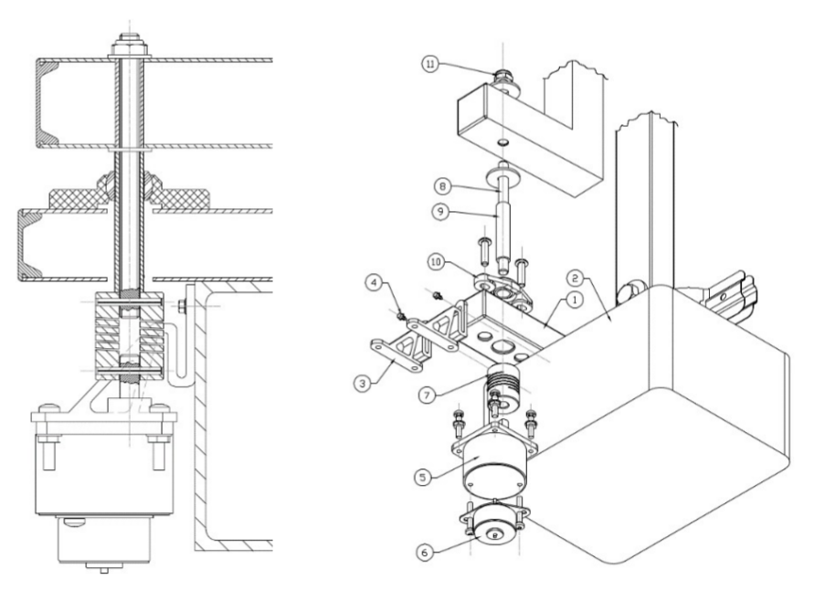

   Figure 3-23  Engine and second reducer mounting representation

The fixed frame (1) host the electronic box (2), which supports the engine assembly (5)+(6) through its
brackets (3). These last are 3D printed with ASA, a flexible plastic, in order to absorb inflections and small
displacements of the motor due to a misalignment of the axis, and are mounted with two self-drilling screws.
The axial joint (7) tolerate parallelism errors between axes, and connect the gear reducer shaft with the
threated rod (8) with two elastic pins. The spacer (9) fix the distance between the top of the joint and the
bottom of the mobile frame; it is a tube with the same diameter of the flange bearing (10). On top, the rod is
tightened by a prevailing torque nut (11).

** Notes **
-----------

The big advantage of having a motor with a residual torque, like steppers, become clear when so reducers
have this kind of indexes. A one thousand Nm torque on the engine shaft becomes few tenths on the
antenna. There are a lot of situations where the engine can bear the wind force, without being powered
ON.

In this prototype, engines are mounted directly on the structure. In future, obviously, they will be put inside
a waterproof enclosure.

As said above, for the moment the design process is not finished, and many radical changes will be
evaluated in order to make the system more accurate and tough. Engines that are good for this version
could be overestimated for further upgraded ones.

----------------------------

.. [#f1] Formfutura VOF, “Technical Data sheet, Product name: ApolloX, Date of issue: 22 April 2016, Version: v1”, www.formfutura.com
.. [#f2] igus, 2018, shop online: www.igus.com
